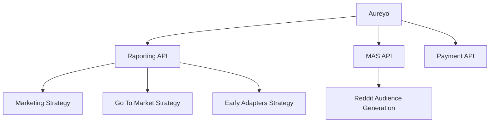

# Aureyo

Aureyo is a powerful marketing tool designed for audience research and analysis. It helps marketers understand their target audience better through comprehensive research and data analysis.

Tables in Firebase:

- userActivities -> Recent activities for generated reports (future notification)
- userPoints -> Points for each user (which he bought)
- reports (saving every raports)
- subscription -> All subscription which are buying

🗂 Serverless node.js function

- mkdir my-lambda-function
- cd my-lambda-function
- npm init -y
- Create an index.js file:

Notion Integration:

https://us-central1-voicesense.cloudfunctions.net/getNotionData

gcloud functions deploy getNotionData \
  --runtime nodejs18 \
  --trigger-http \
  --allow-unauthenticated \
  --env-vars-file env.yaml

